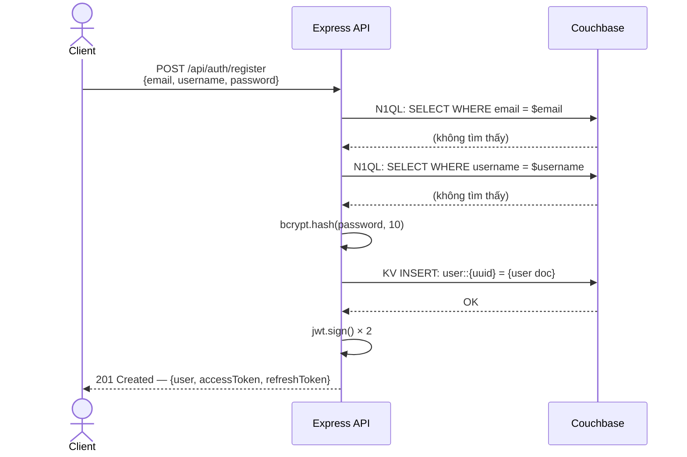
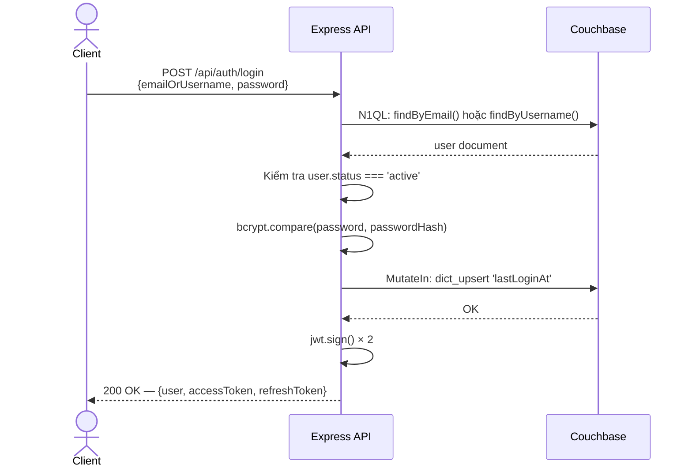
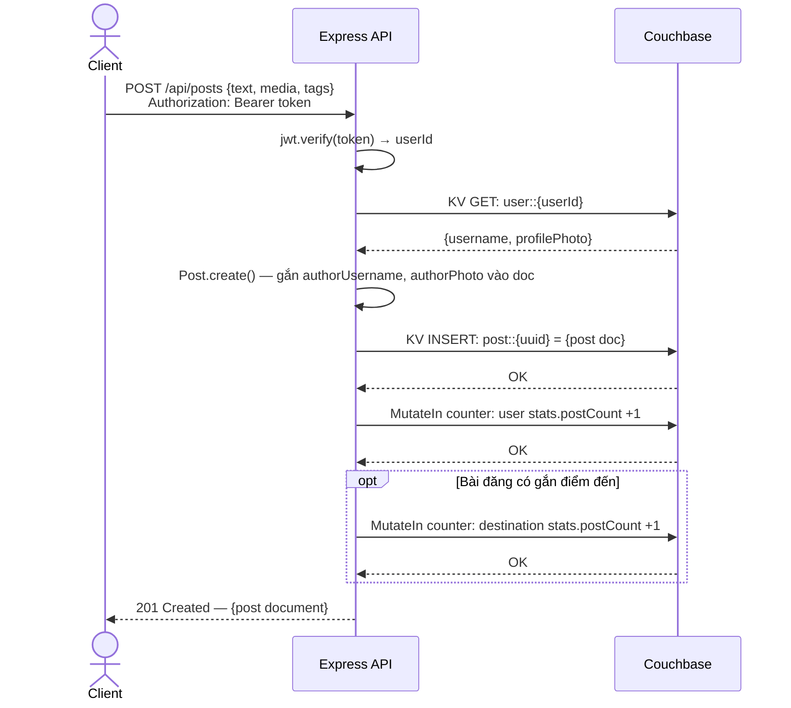
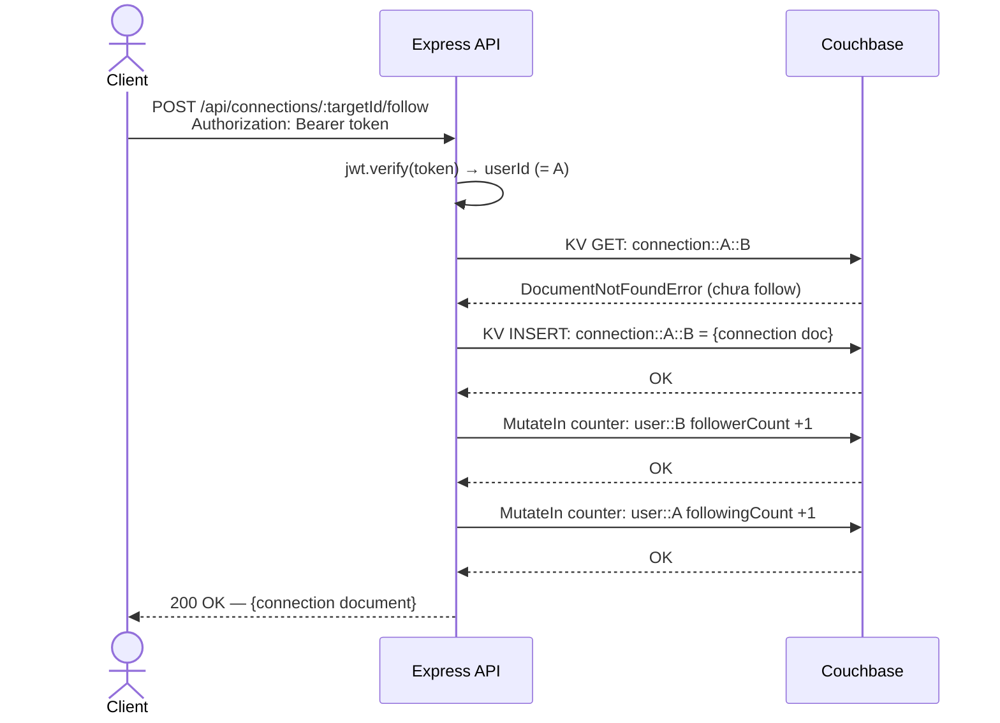

# TIỂU LUẬN CUỐI KỲ — MÔN CƠ SỞ DỮ LIỆU NÂNG CAO

## ỨNG DỤNG COUCHBASE TRONG HỆ THỐNG MẠNG XÃ HỘI DU LỊCH TRAVEL NETWORK

---

| | |
|---|---|
| **Giảng viên hướng dẫn:** | |
| **Sinh viên thực hiện:** | |
| **Mã sinh viên:** | |
| **Lớp:** | |
| **Năm học:** | 2025 – 2026 |

*TP. Hồ Chí Minh, tháng 08 năm 2026*

---

## MỤC LỤC

1. Mở đầu
2. Tổng quan về Couchbase
3. Giới thiệu dự án Travel Network
4. Thiết kế cơ sở dữ liệu Couchbase
5. Triển khai Couchbase trong dự án
6. N1QL và tối ưu hoá truy vấn
7. Luồng xử lý dữ liệu
8. Đánh giá và kết luận
9. Tài liệu tham khảo

---

## DANH MỤC VIẾT TẮT

| Viết tắt | Giải thích |
|---|---|
| API | Application Programming Interface |
| CSDL | Cơ sở dữ liệu |
| JSON | JavaScript Object Notation |
| JWT | JSON Web Token |
| KV | Key-Value |
| N1QL | Non-first Normal Form Query Language |
| NoSQL | Not only SQL |
| REST | Representational State Transfer |
| SDK | Software Development Kit |
| UUID | Universally Unique Identifier |
| CRUD | Create, Read, Update, Delete |
| GSI | Global Secondary Index |
| FTS | Full-Text Search |
| CAS | Check-And-Set |

---

---

# CHƯƠNG 1: MỞ ĐẦU

## 1.1. Lý do chọn đề tài

Trong thập kỷ qua, sự bùng nổ của mạng xã hội và du lịch trực tuyến tạo ra nhu cầu lưu trữ và xử lý dữ liệu phi cấu trúc với tốc độ cao và khối lượng lớn. Các hệ RDBMS truyền thống (MySQL, PostgreSQL) gặp giới hạn về khả năng mở rộng ngang (horizontal scaling) và tính linh hoạt của schema khi đối mặt với mô hình dữ liệu phức tạp, thay đổi liên tục của mạng xã hội.

Couchbase là hệ quản trị cơ sở dữ liệu NoSQL hàng đầu, kết hợp document store linh hoạt với khả năng truy vấn mạnh qua ngôn ngữ N1QL (tương tự SQL). Đề tài được chọn vì:

- **Tính thực tiễn**: Travel Network là dự án thực tế hoàn chỉnh, việc phân tích cách Couchbase được áp dụng mang lại góc nhìn thực tiễn thay vì lý thuyết thuần túy.
- **Sự phù hợp**: Dữ liệu mạng xã hội du lịch (hồ sơ người dùng, bài đăng đa dạng, mối quan hệ theo dõi, chuyến đi với lịch trình phức tạp) là bài toán điển hình mà NoSQL giải quyết hiệu quả hơn SQL.
- **Khoảng trống nghiên cứu**: Tài liệu tiếng Việt về ứng dụng Couchbase trong dự án thực tế còn rất hạn chế, đặc biệt phân tích chi tiết thiết kế schema, tối ưu index và N1QL queries trong ngữ cảnh cụ thể.

## 1.2. Mục tiêu nghiên cứu

- Trình bày tổng quan Couchbase, kiến trúc và so sánh với các hệ NoSQL khác.
- Phân tích thiết kế schema tài liệu JSON, lý giải các quyết định denormalization, document embedding.
- Mô tả chi tiết cách Couchbase tích hợp vào backend Node.js: quản lý kết nối, CRUD, Subdocument API, N1QL, Index Management.
- Đánh giá ưu/nhược điểm và rút ra bài học kinh nghiệm.

## 1.3. Phạm vi nghiên cứu

Tiểu luận tập trung vào Couchbase Server 7.x với Node.js SDK 4.x, toàn bộ backend dự án Travel Network, môi trường phát triển (development).

## 1.4. Cấu trúc tiểu luận

Tiểu luận gồm 8 chương: Mở đầu → Tổng quan Couchbase → Giới thiệu dự án → Thiết kế CSDL → Triển khai → N1QL & tối ưu → Luồng xử lý → Đánh giá & kết luận.

---

# CHƯƠNG 2: TỔNG QUAN VỀ COUCHBASE

## 2.1. NoSQL và Couchbase

**NoSQL** (Not Only SQL) là nhóm hệ CSDL không dùng mô hình quan hệ truyền thống. Bốn loại chính: Document Store, Key-Value Store, Column-Family, Graph Database. Sự ra đời của NoSQL xuất phát từ ba vấn đề mà RDBMS gặp khó khăn: khối lượng dữ liệu lớn (Big Data), tốc độ cao (Velocity), và đa dạng kiểu dữ liệu (Variety).

**Couchbase** được thành lập năm 2011 từ sự sáp nhập của CouchDB (Apache – document store) và Membase (NorthScale – in-memory KV). Đây là **hệ CSDL NoSQL phân tán, hướng tài liệu** lưu JSON, tích hợp cache in-memory, hướng đến sub-millisecond latency cho KV operations.

Các mốc quan trọng: 2015 – N1QL ra đời; 2017 – Full-Text Search tích hợp; 2021 – Couchbase 7.0 với Scopes/Collections và ACID Transactions.

## 2.2. Kiến trúc Couchbase

### 2.2.1. Cluster và Services

Couchbase hoạt động theo mô hình **peer-to-peer cluster** – không có master node. Mỗi node có thể đảm nhiệm một hoặc nhiều service:

| Service | Chức năng |
|---------|-----------|
| **Data Service** | Lưu trữ tài liệu JSON, xử lý KV operations |
| **Query Service** | Thực thi N1QL queries |
| **Index Service** | Quản lý Global Secondary Indexes (GSI) |
| **Search Service** | Full-Text Search với Bleve engine |
| **Analytics Service** | Phân tích dữ liệu lớn |
| **Eventing Service** | Xử lý sự kiện event-driven |

Couchbase dùng **vBucket** (1024 virtual bucket) để phân mảnh dữ liệu: document key được hash để xác định vBucket, các vBucket phân phối đều trên các node. Cơ chế này đảm bảo không có hot spot và rebalancing tự động khi thêm/xóa node.

### 2.2.2. Cấu trúc lưu trữ

Couchbase tổ chức dữ liệu theo bốn cấp lồng nhau. Ở cấp cao nhất là **Cluster** – toàn bộ hệ thống gồm nhiều node vật lý. Bên trong Cluster là các **Bucket**, đơn vị lưu trữ chính, tương đương với một database trong SQL. Từ phiên bản 7.0, mỗi Bucket được chia thành nhiều **Scope** để nhóm các dữ liệu có liên quan, và trong mỗi Scope là các **Collection** (tương đương table trong SQL). Đơn vị nhỏ nhất là **Document** – một tài liệu JSON, tương đương với một hàng (row) trong bảng quan hệ.

Dự án Travel Network sử dụng Default Scope cùng Default Collection, nghĩa là mỗi Bucket chứa trực tiếp các tài liệu mà không phân chia thêm – phù hợp với quy mô ứng dụng vừa và nhỏ.

### 2.2.3. Tính năng nổi bật

- **N1QL**: Ngôn ngữ truy vấn cú pháp giống SQL, hoạt động trên JSON. Hỗ trợ JOIN, subquery, aggregate, array operations.
- **Subdocument API**: Đọc/ghi chỉ một phần document, không cần load toàn bộ – giảm băng thông, tăng tính nhất quán với atomic operations.
- **Full-Text Search**: Tích hợp Bleve engine, hỗ trợ fuzzy match, geo-spatial search.
- **XDCR**: Cross Datacenter Replication – đồng bộ dữ liệu giữa nhiều datacenter toàn cầu.
- **TTL**: Document tự động xóa sau thời gian cấu hình, dùng cho caching.

## 2.3. So sánh Couchbase với các hệ NoSQL khác

| Tiêu chí | Couchbase | MongoDB | Cassandra | Redis |
|----------|-----------|---------|-----------|-------|
| **Mô hình** | Document + KV | Document | Column-Family | Key-Value |
| **Query language** | N1QL (SQL-like) | MQL | CQL | Commands |
| **Mở rộng ngang** | ✅ Tốt | ✅ Tốt | ✅ Xuất sắc | ✅ Tốt |
| **Full-Text Search** | ✅ Tích hợp | ✅ Atlas Search | ❌ Ngoài | ❌ Ngoài |
| **In-Memory Cache** | ✅ Tích hợp | ❌ | ❌ | ✅ Toàn bộ |
| **ACID Transactions** | ✅ (v7.0+) | ✅ (v4.0+) | ❌ Giới hạn | ❌ Partial |
| **KV Latency** | Sub-ms | ~1ms | Sub-ms | Sub-ms |

**Lý do chọn Couchbase cho Travel Network**: Document model phù hợp dữ liệu đa dạng của mạng xã hội; N1QL giảm learning curve cho dev quen SQL; in-memory cache tích hợp không cần thêm Redis riêng; FTS có sẵn không cần Elasticsearch.

## 2.4. Couchbase Node.js SDK

Dự án sử dụng `couchbase@4.2.7` – SDK chính thức, được viết bằng TypeScript và hỗ trợ async/await đầy đủ.

Điểm vào của SDK là hàm `couchbase.connect()`, trả về đối tượng **Cluster** đại diện cho toàn bộ kết nối. Từ Cluster, ta gọi `cluster.bucket(name)` để lấy đối tượng **Bucket** tương ứng, rồi tiếp tục gọi `bucket.defaultCollection()` để lấy đối tượng **Collection** – đây là nơi thực hiện mọi thao tác CRUD với tài liệu.

Collection cung cấp các phương thức chính như sau:

| Phương thức | Mô tả |
|-------------|-------|
| `collection.get(key)` | Đọc tài liệu theo key |
| `collection.insert(key, doc)` | Tạo mới, lỗi nếu key đã tồn tại |
| `collection.upsert(key, doc)` | Tạo mới hoặc ghi đè nếu đã tồn tại |
| `collection.replace(key, doc)` | Cập nhật, lỗi nếu key chưa tồn tại |
| `collection.remove(key)` | Xóa tài liệu |
| `collection.mutateIn(key, [])` | Cập nhật một phần tài liệu (Subdocument API) |

Ngoài ra, đối tượng Cluster còn cung cấp `cluster.query(n1ql, options)` để thực thi các câu truy vấn N1QL trực tiếp trên dữ liệu của bucket.

---

---

# CHƯƠNG 3: GIỚI THIỆU DỰ ÁN TRAVEL NETWORK

## 3.1. Tổng quan

**Travel Network** là ứng dụng mạng xã hội dành cho người yêu du lịch, cho phép chia sẻ trải nghiệm, lên kế hoạch chuyến đi, khám phá điểm đến và kết nối với du khách khác. Đây là hệ thống full-stack hoàn chỉnh:

- **Backend**: Node.js + Express.js (RESTful API, Port 3000)
- **Frontend**: React.js + Tailwind CSS (Port 5173)
- **Database**: Couchbase Server 7.x (Port 8091)
- **Auth**: JWT (Access Token 24h + Refresh Token 7 ngày)
- **Media**: Cloudinary (lưu ảnh/video)

## 3.2. Kiến trúc hệ thống

Hệ thống được tổ chức theo kiến trúc ba lớp. Lớp trình bày là giao diện React.js chạy trên cổng 5173, giao tiếp với lớp ứng dụng thông qua HTTP/REST. Lớp ứng dụng là máy chủ Express.js chạy trên cổng 3000, cung cấp các nhóm API gồm: `/api/auth` (xác thực), `/api/users` (hồ sơ), `/api/trips` (chuyến đi), `/api/posts` (bài đăng), `/api/connections` (kết nối xã hội), `/api/destinations` (điểm đến) và `/api/search` (tìm kiếm). Lớp dữ liệu là Couchbase Server chạy trên cổng 8091, được truy cập thông qua Couchbase Node.js SDK v4, bao gồm bốn bucket: `travel_users`, `travel_content`, `travel_trips` và `travel_social`.

## 3.3. Các chức năng chính

| Nhóm | Chức năng |
|------|-----------|
| **Authentication** | Đăng ký, đăng nhập, refresh token, soft-delete account |
| **User Profile** | Xem/sửa hồ sơ, upload ảnh đại diện, tìm kiếm người dùng |
| **Trip Planning** | CRUD chuyến đi, lịch trình theo ngày, quản lý ngân sách |
| **Posts & Interactions** | Tạo bài đăng (text/ảnh/checkin), like, comment, feed cá nhân |
| **Social** | Follow/unfollow, danh sách followers/following, gợi ý kết nối |
| **Search** | Tìm kiếm thống nhất (users/destinations/posts), autocomplete |

## 3.4. Cấu trúc thư mục backend

Mã nguồn backend được tổ chức theo pattern phân tầng rõ ràng. Thư mục `src/config/` chứa `database.js` – lớp quản lý kết nối Couchbase theo Singleton Pattern. Thư mục `src/models/` định nghĩa schema và các static method cho từng loại tài liệu (User, Post, Trip, Connection, Destination). Thư mục `src/services/` chứa toàn bộ business logic, mỗi service tương ứng một nhóm chức năng: `authService.js`, `userService.js`, `tripService.js`, `postService.js`, `connectionService.js` và `searchService.js`. Thư mục `src/utils/` chứa `queryHelpers.js` (các N1QL query pattern tái sử dụng) và `indexManager.js` (tạo và quản lý indexes). Thư mục `src/scripts/` chứa `initDatabase.js` (khởi tạo indexes và dữ liệu điểm đến) và `seedData.js` (tạo dữ liệu mẫu).

---

# CHƯƠNG 4: THIẾT KẾ CƠ SỞ DỮ LIỆU COUCHBASE

## 4.1. Chiến lược thiết kế tài liệu

Khác với RDBMS (normalize là mặc định), document database yêu cầu thiết kế schema dựa trên **data access patterns**. Dự án áp dụng bốn nguyên tắc chính:

**Nguyên tắc 1 – Denormalization có chủ đích**: Sao chép (denormalize) các trường được đọc thường xuyên cùng nhau vào một document, tránh JOIN. Ví dụ: Post lưu cả `authorUsername` và `authorPhoto` từ User để hiển thị feed không cần JOIN.

**Nguyên tắc 2 – Embedding dữ liệu con**: Comments và likes được nhúng trực tiếp vào Post document thay vì tách thành collection riêng, vì chúng luôn được truy cập cùng bài đăng và số lượng có giới hạn.

**Nguyên tắc 3 – Document Key Design**: Key không chỉ là định danh mà còn tối ưu hóa thao tác lookup. Pattern composite key `connection::{A}::{B}` cho phép kiểm tra "A có follow B không?" bằng **một KV GET duy nhất (O(1), <1ms)** thay vì N1QL query.

**Nguyên tắc 4 – Cached Counters**: Giá trị đếm (`postCount`, `followerCount`) được lưu trong document và cập nhật atomic bằng Subdocument API `counter` opcode, tránh `COUNT(*)` mỗi lần truy vấn.

## 4.2. Tổng quan 4 Bucket

| Bucket | Loại tài liệu | Document Key Pattern |
|--------|---------------|----------------------|
| `travel_users` | User | `user::{uuid}` |
| `travel_content` | Post | `post::{uuid}` |
| `travel_trips` | Trip, Destination | `trip::{uuid}`, `destination::{CC}::{slug}` |
| `travel_social` | Connection | `connection::{followerId}::{followingId}` |

Lưu ý: `travel_trips` chứa cả Trip lẫn Destination, phân biệt qua field `type`. Mỗi document đều có field `type` làm **discriminator** để N1QL có thể filter và index tối ưu.

## 4.3. Schema Bucket `travel_users` – Document User

```json
{
  "id": "550e8400-e29b-41d4-a716-446655440000",
  "type": "user",
  "email": "alice@example.com",
  "username": "alice_traveler",
  "passwordHash": "$2a$10$...",
  "profile": {
    "firstName": "Alice", "lastName": "Johnson",
    "bio": "Adventure seeker 🌍",
    "profilePhoto": "https://cdn.cloudinary.com/photo.jpg",
    "location": { "city": "San Francisco", "country": "USA", "coordinates": null },
    "dateOfBirth": "1990-05-15"
  },
  "interests": ["hiking", "photography", "backpacking"],
  "preferences": {
    "travelStyle": ["adventure", "budget"],
    "languages": ["en", "vi"],
    "privacySettings": { "profileVisibility": "public", "showEmail": false }
  },
  "stats": { "tripCount": 5, "postCount": 23, "followerCount": 45, "followingCount": 67 },
  "verification": { "emailVerified": false, "verificationToken": null },
  "status": "active",
  "createdAt": "2024-01-15T10:30:00.000Z",
  "updatedAt": "2024-02-20T14:22:00.000Z",
  "lastLoginAt": "2024-02-20T14:22:00.000Z"
}
```

**Điểm thiết kế quan trọng**:
- `stats` là cached counters, không phải giá trị tính toán realtime – cập nhật bằng `mutateIn counter`
- `status: 'deleted'` thực hiện soft delete – bảo tồn dữ liệu cho compliance
- `passwordHash` không bao giờ được trả về API response (loại bỏ trong `toPublicProfile()`)

## 4.4. Schema Bucket `travel_content` – Document Post

```json
{
  "id": "a1b2c3d4-e5f6-7890-abcd-ef1234567890",
  "type": "post",
  "authorId": "550e8400-...",
  "authorUsername": "alice_traveler",
  "authorPhoto": "https://cdn.../alice.jpg",
  "postType": "photo",
  "content": {
    "text": "Sunrise at Machu Picchu! 🌄",
    "media": [{ "type": "image", "url": "https://cdn.../photo.jpg", "caption": "Sun Gate" }]
  },
  "tripId": "trip-uuid-001",
  "destinationId": "destination::PE::machu-picchu",
  "destinationName": "Machu Picchu",
  "destinationCountry": "Peru",
  "location": { "name": "Machu Picchu, Peru", "coordinates": { "lat": -13.16, "lon": -72.54 } },
  "tags": ["travel", "peru", "hiking"],
  "visibility": "public",
  "stats": { "viewCount": 1250, "likeCount": 87, "commentCount": 12 },
  "interactions": {
    "likes": ["user-uuid-1", "user-uuid-2"],
    "comments": [{
      "id": "comment-uuid-1", "userId": "user-uuid-bob",
      "username": "explorer_bob", "text": "Stunning!", "createdAt": "2024-01-16T..."
    }]
  },
  "createdAt": "2024-01-15T06:30:00.000Z",
  "updatedAt": "2024-01-16T08:30:00.000Z"
}
```

**Điểm thiết kế**: Comments và likes được **embedded** trong post. Một GET duy nhất trả về toàn bộ bài đăng kèm tương tác – không cần JOIN. `likes` là mảng userId để kiểm tra "đã like chưa" bằng `Array.includes()` mà không cần query thêm.

## 4.5. Schema Bucket `travel_trips`

### Trip Document

```json
{
  "id": "trip-uuid-001",
  "type": "trip",
  "userId": "user-uuid-alice",
  "title": "Southeast Asia Backpacking 2024",
  "description": "3-month journey through Thailand, Vietnam, Cambodia",
  "destinations": [
    { "destinationId": "destination::TH::bangkok", "name": "Bangkok",
      "country": "Thailand", "arrivalDate": "2024-06-01", "departureDate": "2024-06-07" }
  ],
  "startDate": "2024-06-01",  "endDate": "2024-08-31",
  "status": "planning",
  "visibility": "public",
  "itinerary": [
    { "day": 1, "date": "2024-06-01",
      "activities": ["Arrive Suvarnabhumi Airport", "Check in hotel"],
      "notes": "Exchange currency at airport" }
  ],
  "budget": { "total": 5000, "currency": "USD",
              "breakdown": { "accommodation": 1500, "transport": 1200, "food": 800 } },
  "participants": [
    { "userId": "user-uuid-alice", "username": "alice_traveler", "status": "confirmed" }
  ],
  "tags": ["backpacking", "southeast-asia", "budget"],
  "createdAt": "2024-01-10T09:00:00.000Z",
  "updatedAt": "2024-02-15T11:30:00.000Z"
}
```

### Destination Document

Key: `destination::FR::paris` (Natural key – ngăn trùng lặp, map trực tiếp từ URL `/api/destinations/FR/paris`)

```json
{
  "id": "d4e5f6-uuid",  "type": "destination",
  "name": "Paris",  "slug": "paris",
  "country": "France",  "countryCode": "FR",
  "coordinates": { "lat": 48.8566, "lon": 2.3522 },
  "description": "The City of Light, known for art, fashion, gastronomy...",
  "summary": "Iconic city famous for Eiffel Tower and romantic atmosphere.",
  "categories": ["city", "cultural", "romantic"],
  "tags": ["romantic", "cultural", "food", "art", "museums"],
  "climate": { "type": "temperate", "bestMonths": [4, 5, 6, 9, 10] },
  "travelInfo": { "currency": "EUR", "languages": ["French"], "timezone": "CET" },
  "stats": { "tripCount": 156, "postCount": 432, "viewCount": 15420, "rating": 4.7 }
}
```

## 4.6. Schema Bucket `travel_social` – Document Connection

Key: `connection::{followerId}::{followingId}`

```json
{
  "type": "connection",
  "followerId": "user-uuid-alice",
  "followerUsername": "alice_traveler",
  "followingId": "user-uuid-bob",
  "followingUsername": "explorer_bob",
  "status": "active",
  "createdAt": "2024-02-10T15:30:00.000Z"
}
```

**Thiết kế đặc biệt**: Composite key `connection::A::B` cho phép kiểm tra "A follow B?" bằng một KV GET duy nhất. Kiểm tra mutual follow dùng hai KV GET song song (Promise.all). Đây là tối ưu O(1) thay vì N1QL query có index.

---

---

# CHƯƠNG 5: TRIỂN KHAI COUCHBASE TRONG DỰ ÁN

## 5.1. Kết nối và quản lý kết nối

### 5.1.1. Singleton Pattern – DatabaseConnection

`src/config/database.js` triển khai **Singleton Pattern** – chỉ một instance duy nhất tồn tại trong toàn ứng dụng. Couchbase SDK đã tích hợp connection pooling bên trong nên không cần tạo nhiều kết nối.

```javascript
class DatabaseConnection {
  async connect() {
    this.cluster = await couchbase.connect(connectionString, {
      username, password,
      timeouts: { kvTimeout: 10000, queryTimeout: 75000 },
      configProfile: 'wanDevelopment',
    });
    await this.initializeBuckets();
    this.isConnected = true;
  }

  async initializeBuckets() {
    for (const [key, bucketName] of Object.entries(bucketNames)) {
      const bucket = this.cluster.bucket(bucketName);
      await bucket.waitUntilReady(5000);           // Chờ bucket sẵn sàng
      this.buckets[key] = {
        bucket,
        defaultCollection: bucket.defaultCollection(),
      };
    }
  }
}
const dbConnection = new DatabaseConnection();
export default dbConnection;  // Export singleton
```

Server chỉ khởi động (`app.listen`) **sau khi** database đã kết nối thành công, tránh request lỗi khi DB chưa sẵn sàng.

### 5.1.2. Graceful Shutdown

Khi nhận SIGTERM (deploy mới, tắt server), ứng dụng đóng HTTP server trước, sau đó đóng Couchbase cluster connection (`dbConnection.disconnect()`), đảm bảo không mất request đang xử lý.

## 5.2. Chức năng Xác thực người dùng

**File**: `src/services/authService.js`

### 5.2.1. Đăng ký

Quy trình: Kiểm tra email/username trùng (N1QL) → Hash password (bcrypt) → Insert document vào Couchbase → Cấp JWT.

```javascript
// Kiểm tra trùng bằng N1QL (parameterized – ngăn injection)
const existing = await cluster.query(
  `SELECT META().id FROM travel_users WHERE type='user' AND email=$email LIMIT 1`,
  { parameters: { email } }
);

// Lưu vào Couchbase bằng KV insert
await collection.insert(`user::${user.id}`, user);
// insert() throw DocumentExistsError nếu key đã tồn tại
```

### 5.2.2. Đăng nhập

Quy trình: Tìm user (N1QL theo email/username) → Kiểm tra status → Verify password (bcrypt.compare) → Cập nhật `lastLoginAt` (mutateIn) → Cấp JWT.

```javascript
// Cập nhật lastLoginAt bằng Subdocument API – chỉ ghi 1 field thay vì toàn bộ document
await collection.mutateIn(`user::${user.id}`, [
  { opcode: 'dict_upsert', path: 'lastLoginAt', value: new Date().toISOString() }
]);
```

### 5.2.3. Refresh Token

Verify JWT signature → KV GET kiểm tra user còn active (dùng KV thay vì N1QL vì đã biết key) → Cấp token mới. Dùng KV GET vì đã biết `userId` từ token decoded – nhanh hơn N1QL đáng kể (~0.1ms vs ~2-5ms).

## 5.3. Chức năng Quản lý hồ sơ người dùng

**File**: `src/services/userService.js`

### 5.3.1. Lấy hồ sơ

```javascript
// KV GET – O(1), sub-millisecond
const result = await collection.get(`user::${userId}`);

// Tính stats thực tế từ DB – 4 queries SONG SONG
const [postCount, followerCount, followingCount, tripCount] = await Promise.all([
  PostQueries.countByAuthor(userId),
  ConnectionQueries.countFollowers(userId),
  ConnectionQueries.countFollowing(userId),
  TripQueries.countByUserId(userId),
]);
// Parallel: ~5ms tổng, thay vì sequential: ~20ms
```

### 5.3.2. Cập nhật hồ sơ

Pattern **Read-Modify-Write**: GET document → sửa trong bộ nhớ theo whitelist fields → UPSERT lại. Whitelist đảm bảo user không thể tự sửa `email`, `passwordHash`, `stats`, `status`.

## 5.4. Chức năng Quản lý chuyến đi

**File**: `src/services/tripService.js`

### 5.4.1. Tạo và xóa chuyến đi

Khi tạo trip, sau khi INSERT document, cập nhật `stats.tripCount` trong user document và `stats.tripCount` của từng destination bằng **Subdocument counter** – atomic, không bị race condition.

```javascript
await collection.insert(`trip::${trip.id}`, trip);

// Counter atomic – tránh race condition khi nhiều request đồng thời
await collection.mutateIn(`user::${userId}`, [
  { opcode: 'counter', path: 'stats.tripCount', delta: 1 }
]);
```

Khi xóa trip: GET để verify ownership (authorization check) → REMOVE document → Counter -1 cho user và destinations.

### 5.4.2. Truy vấn chuyến đi

```sql
-- Lấy trips của user, sort theo ngày khởi hành
SELECT META(t).id, t.*
FROM `travel_trips` t
WHERE t.type = 'trip' AND t.userId = $userId
ORDER BY t.startDate DESC
LIMIT $limit OFFSET $offset
```

## 5.5. Chức năng Bài đăng và Tương tác

**File**: `src/services/postService.js`

### 5.5.1. Tạo bài đăng

Denormalize `authorUsername` và `authorPhoto` vào post document ngay lúc tạo, tránh JOIN khi load feed.

### 5.5.2. Like / Unlike

Pattern: GET post → kiểm tra đã like chưa → thêm/xóa userId trong `interactions.likes[]` → cập nhật `stats.likeCount` → UPSERT toàn bộ document.

### 5.5.3. Cập nhật bài đăng với MutateInSpec

Khi update post, dùng `MutateInSpec` để chỉ ghi các field thay đổi – giảm băng thông, không cần đọc toàn document:

```javascript
const mutations = [];
if (updates.text !== undefined)
  mutations.push(couchbase.MutateInSpec.upsert('content.text', updates.text));
if (updates.tags !== undefined)
  mutations.push(couchbase.MutateInSpec.upsert('tags', updates.tags));
mutations.push(couchbase.MutateInSpec.upsert('updatedAt', new Date().toISOString()));

await collection.mutateIn(`post::${postId}`, mutations);
```

### 5.5.4. Feed cá nhân

```sql
SELECT META(p).id, p.*
FROM travel_content p
WHERE p.type = 'post'
  AND p.visibility = 'public'
  AND p.authorId IN (
    SELECT RAW c.followingId       -- Subquery: danh sách đang follow
    FROM travel_social c
    WHERE c.type = 'connection' AND c.followerId = $userId AND c.status = 'active'
  )
ORDER BY p.createdAt DESC
LIMIT $limit OFFSET $offset
```

`SELECT RAW` trả về scalar values (string array) thay vì objects, phù hợp dùng trong `IN` clause.

## 5.6. Chức năng Mạng xã hội

**File**: `src/services/connectionService.js`

### 5.6.1. Follow

```javascript
const key = `connection::${followerId}::${followingId}`;

// Kiểm tra đã follow chưa bằng KV GET (nhanh hơn N1QL)
try {
  await collection.get(key);
  throw { statusCode: 409, message: 'Already following' };
} catch (e) {
  if (e.name !== 'DocumentNotFoundError') throw e;
  // DocumentNotFoundError → chưa follow → tiếp tục
}

await collection.insert(key, connectionDoc);
await updateFollowerCount(followingId, +1);
await updateFollowingCount(followerId, +1);
```

### 5.6.2. Kiểm tra trạng thái kết nối

```javascript
// Hai KV GET song song: kiểm tra A→B và B→A đồng thời
const [isFollowing, isFollowedBy] = await Promise.all([
  collection.get(`connection::${userId}::${targetId}`).then(()=>true).catch(()=>false),
  collection.get(`connection::${targetId}::${userId}`).then(()=>true).catch(()=>false),
]);
return { isFollowing, isFollowedBy, isMutual: isFollowing && isFollowedBy };
```

### 5.6.3. Gợi ý kết nối

```sql
SELECT u.id, u.username, u.profile, u.stats
FROM `travel_users` u
WHERE u.type = 'user' AND u.status = 'active' AND u.id != $userId
  AND u.id NOT IN (
    SELECT RAW c.followingId FROM `travel_social` c
    WHERE c.type = 'connection' AND c.followerId = $userId
  )
ORDER BY IFMISSINGORNULL(u.stats.followerCount, 0) DESC
LIMIT $limit
```

`IFMISSINGORNULL()` là hàm N1QL xử lý field chưa tồn tại hoặc null – tránh lỗi runtime.

## 5.7. Chức năng Tìm kiếm

**File**: `src/services/searchService.js`

Unified search thực hiện ba loại search **song song** bằng `Promise.all`:

```javascript
const [userResults, destResults, postResults] = await Promise.all([
  types.includes('users')        ? searchUsers(query, limit)        : [],
  types.includes('destinations') ? searchDestinations(query, limit) : [],
  types.includes('posts')        ? searchPosts(query, limit)        : [],
]);
```

Tìm kiếm trong mảng tags dùng cú pháp N1QL đặc trưng:

```sql
ANY tag IN d.tags SATISFIES LOWER(tag) LIKE $query END
```

---

---

# CHƯƠNG 6: N1QL VÀ TỐI ƯU HOÁ TRUY VẤN

## 6.1. Tổng quan N1QL

N1QL (Non-first Normal Form Query Language, phát âm "nickel") là ngôn ngữ truy vấn do Couchbase phát triển, lần đầu ra mắt trong Couchbase Server 4.0 (2015). Tên gọi xuất phát từ **NF² (Non-First Normal Form)** – cấu trúc dữ liệu lồng nhau mà N1QL được thiết kế xử lý.

**So sánh chính giữa N1QL và SQL:**

| Đặc điểm | SQL | N1QL |
|----------|-----|------|
| Nguồn dữ liệu | Tables (rows & columns) | Buckets (JSON documents) |
| Nested access | JOIN với bảng con | `object.nested.field` trực tiếp |
| Tìm trong mảng | Subquery phức tạp | `ANY ... IN ... SATISFIES ... END` |
| Missing values | NULL | `MISSING` hoặc NULL; dùng `IFMISSINGORNULL()` |
| Metadata | System tables | `META().id`, `META().cas` |
| JOIN | JOIN tables | `JOIN ON KEYS` (key-based, nhanh hơn index join) |

**Các câu lệnh N1QL quan trọng trong dự án:**

```sql
-- 1. Tìm user theo email (dùng trong đăng nhập)
SELECT META().id, u.* FROM travel_users u
WHERE u.type = 'user' AND u.email = $email LIMIT 1;

-- 2. Feed với Subquery và SELECT RAW
SELECT META(p).id, p.* FROM travel_content p
WHERE p.type = 'post' AND p.visibility = 'public'
  AND p.authorId IN (
    SELECT RAW c.followingId FROM travel_social c
    WHERE c.type = 'connection' AND c.followerId = $userId
  )
ORDER BY p.createdAt DESC LIMIT $limit OFFSET $offset;

-- 3. JOIN giữa hai bucket (ON KEYS – key-based lookup)
SELECT META(t).id, t.*, u.username, u.profile.profilePhoto
FROM `travel_trips` t
JOIN `travel_users` u ON KEYS ('user::' || t.userId)
WHERE t.type = 'trip' AND t.status = 'planning'
  AND t.startDate BETWEEN $start AND $end;

-- 4. Tìm trips có destination cụ thể (Array condition)
SELECT META().id, t.* FROM `travel_trips` t
WHERE t.type = 'trip'
  AND ANY d IN t.destinations SATISFIES d.destinationId = $destId END;

-- 5. Mutual connections
SELECT c1.followingId FROM travel_social c1
WHERE c1.followerId = $userId1
  AND c1.followingId IN (
    SELECT RAW c2.followingId FROM travel_social c2
    WHERE c2.followerId = $userId2
  );
```

## 6.2. Thiết kế Index

Index trong Couchbase hoạt động như **Global Secondary Index (GSI)** – được lưu trên Index Service nodes riêng biệt, không ảnh hưởng hiệu năng lưu trữ dữ liệu.

### 6.2.1. Partial Index – Tính năng quan trọng

Tất cả index trong dự án đều là **Partial Index** với điều kiện `WHERE type = 'xxx'`:

```sql
CREATE INDEX idx_users_email ON travel_users(email) WHERE type = 'user';
```

Lợi ích: Index nhỏ hơn (chỉ chứa documents đúng loại), cập nhật nhanh hơn, Query Planner chính xác hơn.

### 6.2.2. Danh sách toàn bộ Indexes

**Bucket `travel_users`:**

| Index | Columns | Mục đích |
|-------|---------|----------|
| `idx_users_primary` | PRIMARY | Dev/admin queries |
| `idx_users_email` | `email` WHERE type='user' | Đăng nhập bằng email |
| `idx_users_username` | `username` WHERE type='user' | Đăng nhập bằng username, tìm kiếm |
| `idx_users_created` | `createdAt DESC` WHERE type='user' | Sort theo thời gian |
| `idx_users_location` | `location.country, city` WHERE type='user' | Tìm theo địa điểm |

**Bucket `travel_trips`:**

| Index | Columns | Mục đích |
|-------|---------|----------|
| `idx_trips_user` | `userId, startDate DESC` WHERE type='trip' | Lấy trips của user |
| `idx_trips_status` | `status, startDate` WHERE type='trip' | Filter theo trạng thái |
| `idx_trips_dates` | `startDate, endDate` WHERE type='trip' | Tìm trips theo ngày |
| `idx_trips_destinations` | `DISTINCT ARRAY d.destinationId FOR d IN destinations END` | Tìm trips có destination |
| `idx_destinations_slug` | `countryCode, slug` WHERE type='destination' | Lookup điểm đến |

**Bucket `travel_content`:**

| Index | Columns | Mục đích |
|-------|---------|----------|
| `idx_posts_author` | `authorId, createdAt DESC` WHERE type='post' | Posts của user |
| `idx_posts_destination` | `destinationId, createdAt DESC` WHERE type='post' | Posts về điểm đến |
| `idx_posts_created` | `createdAt DESC, visibility` WHERE type='post' | Feed, popular posts |
| `idx_posts_tags` | `DISTINCT ARRAY t FOR t IN tags END` WHERE type='post' | Tìm theo tag |

**Bucket `travel_social`:**

| Index | Columns | Mục đích |
|-------|---------|----------|
| `idx_connections_follower` | `followerId, createdAt DESC` | Danh sách following |
| `idx_connections_following` | `followingId, createdAt DESC` | Danh sách followers |

### 6.2.3. Array Index – Đặc trưng của Document Database

`idx_trips_destinations` và `idx_posts_tags` là **Array Index** – loại index đặc trưng của document database, cho phép index từng phần tử trong mảng:

```sql
CREATE INDEX idx_trips_destinations
ON travel_trips(DISTINCT ARRAY d.destinationId FOR d IN destinations END)
WHERE type = 'trip';

-- Khi dùng: ANY d IN t.destinations SATISFIES d.destinationId = $id END
-- Query Planner sử dụng được array index này
```

## 6.3. Subdocument API – MutateIn

Subdocument API cho phép thao tác chỉ một phần document, giao tiếp trực tiếp với Data Service:

| Opcode | Tác dụng | Ứng dụng trong dự án |
|--------|----------|----------------------|
| `dict_upsert` | Tạo hoặc cập nhật field | Cập nhật `lastLoginAt`, `status` |
| `counter` | Tăng/giảm giá trị số (atomic) | Cập nhật `stats.postCount`, `stats.followerCount` |
| `MutateInSpec.upsert` | Cập nhật field (API mới, type-safe) | Cập nhật nội dung bài đăng |

**So sánh Read-Modify-Write vs Subdocument:**

| | Read-Modify-Write | Subdocument API |
|-|-------------------|-----------------|
| Băng thông | Cao (toàn bộ document) | Thấp (chỉ path + value) |
| Atomic | Không (khoảng gap giữa read & write) | Có (server-side) |
| Dùng khi | Cập nhật nhiều field phức tạp | Cập nhật ít field, counters |

---

---

# CHƯƠNG 7: LUỒNG XỬ LÝ DỮ LIỆU

## 7.1. Danh sách API Endpoints

| Nhóm | Method + Endpoint | Mô tả |
|------|-------------------|-------|
| **Auth** | POST `/api/auth/register` | Đăng ký |
| | POST `/api/auth/login` | Đăng nhập |
| | POST `/api/auth/refresh` | Làm mới token |
| | GET `/api/auth/me` | User hiện tại |
| **Users** | GET `/api/users/me` | Hồ sơ cá nhân |
| | PATCH `/api/users/me` | Cập nhật hồ sơ |
| | GET `/api/users/:id` | Xem hồ sơ người khác |
| | GET `/api/users/search?q=` | Tìm kiếm |
| **Trips** | POST `/api/trips` | Tạo chuyến đi |
| | GET `/api/trips` | Danh sách trips |
| | PATCH `/api/trips/:id` | Cập nhật |
| | DELETE `/api/trips/:id` | Xóa |
| **Posts** | POST `/api/posts` | Tạo bài đăng |
| | GET `/api/posts/feed` | Feed cá nhân |
| | POST `/api/posts/:id/like` | Like |
| | POST `/api/posts/:id/comments` | Bình luận |
| **Connections** | POST `/api/connections/:id/follow` | Follow |
| | DELETE `/api/connections/:id/follow` | Unfollow |
| | GET `/api/connections/:id/followers` | Danh sách followers |
| **Destinations** | GET `/api/destinations/:cc/:slug` | Chi tiết điểm đến |
| | GET `/api/destinations/search?q=` | Tìm kiếm |
| **Search** | GET `/api/search?q=` | Tìm kiếm thống nhất |

## 7.2. Luồng Đăng ký người dùng



`collection.insert()` được dùng thay vì `upsert()` vì nó báo lỗi ngay nếu key đã tồn tại – đây là lớp bảo vệ cuối trước tình huống UUID collision cực kỳ hiếm gặp.

## 7.3. Luồng Đăng nhập



Bước cập nhật `lastLoginAt` dùng Subdocument API thay vì ghi lại toàn bộ document – chỉ truyền đúng một path và giá trị, giảm băng thông đáng kể khi thao tác này được gọi mỗi lần đăng nhập.

## 7.4. Luồng Tạo bài đăng



`authorUsername` và `authorPhoto` được denormalize vào post document ngay tại bước tạo, tránh phải JOIN với bucket `travel_users` mỗi khi tải feed.

## 7.5. Luồng Follow người dùng



Việc kiểm tra "đã follow chưa" dùng KV GET thay vì N1QL query – nhờ composite key `connection::A::B`, thao tác này chỉ mất khoảng 0.1ms so với 2–5ms nếu dùng query có index. Để kiểm tra trạng thái hai chiều (A→B và B→A), hệ thống thực hiện hai KV GET song song bằng `Promise.all()`, tổng thời gian bằng một request thay vì gấp đôi.

## 7.6. Khởi tạo và Seed dữ liệu

```bash
npm run db:init    # Tạo 20+ indexes + seed 10 destinations mẫu
npm run db:seed    # Seed 5 users, 20 connections, 8 posts, 3 trips
```

Sau khi seed, hệ thống có sẵn các tài khoản thử nghiệm:

| Username | Email | Password |
|----------|-------|----------|
| traveler_sarah | sarah@example.com | password123 |
| explorer_mike | mike@example.com | password123 |
| wanderlust_emma | emma@example.com | password123 |
| adventure_alex | alex@example.com | password123 |
| cultural_lisa | lisa@example.com | password123 |

---

# CHƯƠNG 8: ĐÁNH GIÁ VÀ KẾT LUẬN

## 8.1. Ưu điểm của Couchbase trong dự án

### 8.1.1. Mô hình document phù hợp với dữ liệu mạng xã hội

Trong RDBMS, để lưu một bài đăng với likes, comments, media cần tối thiểu 4 bảng và 3 JOINs. Trong Couchbase, tất cả trong **một document** – một GET duy nhất trả về toàn bộ bài đăng kèm tương tác. Code đơn giản hơn, hiệu năng cao hơn, không có JOIN overhead.

### 8.1.2. Document Key Design tối ưu lookup phổ biến

Pattern `connection::{A}::{B}` biến thao tác "A có follow B không?" từ N1QL query (~2-5ms) thành KV GET (~0.1ms). Trong mạng xã hội, thao tác này được gọi hàng nghìn lần/giây – tối ưu này có tác động lớn đến hiệu năng tổng thể.

Tương tự, `destination::FR::paris` cho phép URL `/api/destinations/FR/paris` map trực tiếp thành document key, không cần lookup trung gian.

### 8.1.3. Subdocument API giảm băng thông và đảm bảo tính nguyên tử

`counter` opcode cho phép tăng/giảm bộ đếm **atomically** tại server, không bị race condition. `MutateInSpec` chỉ ghi các field thay đổi thay vì toàn bộ document – quan trọng khi document lớn (post với nhiều comments).

### 8.1.4. N1QL giảm learning curve

Cú pháp N1QL rất gần SQL, developer không cần học một query language hoàn toàn mới (khác MongoDB MQL). Feed query với subquery, aggregate, ORDER BY, LIMIT/OFFSET đều quen thuộc với developer SQL.

### 8.1.5. Promise.all() song song hóa queries

Couchbase SDK hỗ trợ async/await đầy đủ. Việc lấy 4 stats của user song song (`Promise.all`) giảm thời gian từ 4×5ms = 20ms xuống còn ~5ms. Tương tự, kiểm tra mutual connection dùng 2 KV GET song song.

## 8.2. Hạn chế và thách thức

### 8.2.1. Thiếu ACID Transactions cho multi-bucket operations

Một số thao tác yêu cầu nhất quán giữa nhiều bucket nhưng chưa dùng transaction:

```javascript
// Nếu insert post thành công nhưng cập nhật counter thất bại
// → stats.postCount không chính xác
await collection.insert(Post.getKey(post.id), post);   // Bucket: content
await updateUserPostCount(userId, 1);                  // Bucket: users – có thể fail
```

Couchbase 7.0+ hỗ trợ Multi-Document ACID Transactions nhưng dự án chưa tận dụng. Giải pháp tạm thời là try-catch và log, sau đó có script reconcile định kỳ.

### 8.2.2. Read-Modify-Write không atomic – nguy cơ lost update

Thao tác like dùng Read-Modify-Write pattern có thể xảy ra **lost update** khi hai request đồng thời:

- Request A đọc post (likes: [u1])
- Request B đọc post (likes: [u1])
- A ghi (likes: [u1, uA])
- B ghi (likes: [u1, uB]) → **mất uA!**

Giải pháp đúng là **CAS (Check-And-Set)** của Couchbase: sau khi GET lấy CAS token, khi REPLACE kiểm tra CAS – nếu document đã thay đổi (CAS mismatch) thì retry. Dự án chưa implement tính năng này.

### 8.2.3. LIKE queries với wildcard đầu không dùng được index

```sql
-- Không dùng index (full bucket scan)
WHERE LOWER(u.username) LIKE '%alice%'

-- Dùng được index (prefix match)
WHERE LOWER(u.username) LIKE 'alice%'
```

Với tìm kiếm toàn văn, giải pháp tốt hơn là **Full-Text Search (FTS)** của Couchbase (có sẵn, tích hợp Bleve), hỗ trợ fuzzy match, typo tolerance, relevance ranking.

### 8.2.4. Thiếu schema enforcement và migration

Couchbase **schema-less** – không enforce schema ở tầng database. Nếu code thay đổi cấu trúc document, các document cũ không tự migrate. Dự án phụ thuộc hoàn toàn vào validation trong application code (`User.validate()`) và không có migration scripts.

### 8.2.5. N+1 Problem trong enrichment

Khi lấy danh sách followers, mỗi connection document cần thêm một KV GET để lấy user profile – tổng N+1 operations. Dù dùng `Promise.all` (song song) nhưng vẫn tạo N connections riêng. Giải pháp tốt hơn là JOIN trong N1QL hoặc batch lookup.

## 8.3. Hướng phát triển

**Full-Text Search**: Thay LIKE queries bằng Couchbase FTS với fuzzy matching và relevance ranking – quan trọng cho tìm kiếm tên điểm đến có dấu/không dấu.

**Multi-Document Transactions**: Wrap các thao tác liên quan nhiều bucket vào ACID transaction của Couchbase 7.0, đảm bảo tính nhất quán dữ liệu.

**CAS-based Optimistic Locking**: Implement retry loop với CAS để xử lý concurrent updates (like/unlike, counter updates).

**TTL Caching**: Dùng Couchbase TTL để cache kết quả phổ biến (popular posts, destination catalog) không cần thêm Redis riêng – tận dụng in-memory tier sẵn có.

**Geo-spatial Search**: Tích hợp Couchbase Search geo-distance queries để tìm "điểm đến gần tôi" – tính năng có giá trị cao cho Travel Network.

**Couchbase Eventing**: Kích hoạt notifications tự động khi có like/comment bằng Eventing service, không cần polling.

## 8.4. Kết luận

Tiểu luận đã phân tích toàn diện việc ứng dụng Couchbase vào dự án Travel Network, từ thiết kế 4 bucket với schema JSON đầy đủ, đến triển khai 6 nhóm chức năng chính, tối ưu hóa với 20+ indexes và Subdocument API.

**Bài học kinh nghiệm cốt lõi:**

1. **Document design phải xuất phát từ access patterns**: Không normalize trước rồi denormalize sau. Hỏi "query nào được gọi nhiều nhất?" rồi thiết kế document phù hợp ngay từ đầu.

2. **KV operations trước, N1QL sau**: Khi đã biết document key, luôn dùng KV GET/SET (sub-millisecond) thay vì N1QL query (vài milliseconds). Composite key pattern cho Connection là ví dụ điển hình.

3. **Index design quan trọng như schema design**: Query thiếu index phù hợp sẽ full scan toàn bucket. Partial Index, Array Index, Composite Index phải được thiết kế song song với schema.

4. **Consistency không miễn phí**: Không có foreign key, application code phải tự đảm bảo nhất quán. Cần thiết kế cẩn thận và có kế hoạch xử lý partial failure.

Couchbase chứng tỏ là lựa chọn phù hợp cho bài toán mạng xã hội du lịch nhờ document model linh hoạt, N1QL mạnh mẽ, và KV performance xuất sắc. Thách thức chính là đòi hỏi người phát triển hiểu sâu về NoSQL paradigm – không thể áp đặt tư duy relational lên document database.

---

# CHƯƠNG 9: TÀI LIỆU THAM KHẢO

1. **Couchbase Inc.** (2024). *Couchbase Server Developer Guide*. https://docs.couchbase.com/server/current/introduction/intro.html

2. **Couchbase Inc.** (2024). *N1QL Language Reference*. https://docs.couchbase.com/server/current/n1ql/n1ql-language-reference/index.html

3. **Couchbase Inc.** (2024). *Node.js SDK 4.x – Getting Started*. https://docs.couchbase.com/nodejs-sdk/current/hello-world/start-using-sdk.html

4. **Couchbase Inc.** (2024). *Sub-Document Operations*. https://docs.couchbase.com/nodejs-sdk/current/howtos/subdocument-operations.html

5. **Couchbase Inc.** (2024). *Indexes and Query Performance*. https://docs.couchbase.com/server/current/learn/services-and-indexes/indexes/indexes.html

6. **Couchbase Inc.** (2024). *ACID Transactions*. https://docs.couchbase.com/nodejs-sdk/current/howtos/distributed-acid-transactions-from-the-sdk.html

7. **Sadalage, P. J., & Fowler, M.** (2012). *NoSQL Distilled: A Brief Guide to the Emerging World of Polyglot Persistence*. Addison-Wesley Professional.

8. **Brewer, E.** (2000). *Towards Robust Distributed Systems*. PODC 2000. *(CAP Theorem – nền tảng thiết kế NoSQL)*

9. **DeCandia, G., et al.** (2007). *Dynamo: Amazon's Highly Available Key-value Store*. SOSP 2007. *(Nền tảng lý thuyết KV stores và eventual consistency)*

10. **OWASP Foundation** (2024). *Injection Prevention Cheat Sheet*. https://cheatsheetseries.owasp.org/cheatsheets/Injection_Prevention_Cheat_Sheet.html

11. **Auth0** (2024). *Introduction to JSON Web Tokens*. https://jwt.io/introduction

12. **Node.js Foundation** (2024). *Node.js v18 Documentation*. https://nodejs.org/en/docs

13. **Travel Network Source Code** (2024). Mã nguồn dự án – `c:\Workspace\caohoc\travelnetwork\src\`

---

## PHỤ LỤC: Cấu hình môi trường

```env
# .env – Cấu hình Couchbase cho Travel Network
COUCHBASE_CONNECTION_STRING=couchbase://localhost
COUCHBASE_USERNAME=Administrator
COUCHBASE_PASSWORD=your_password

BUCKET_USERS=travel_users
BUCKET_CONTENT=travel_content
BUCKET_TRIPS=travel_trips
BUCKET_SOCIAL=travel_social

JWT_SECRET=your-secure-random-key-min-32-chars
JWT_EXPIRES_IN=24h
JWT_REFRESH_EXPIRES_IN=7d
```

**Hướng dẫn cài đặt nhanh:**

```bash
npm install             # Cài dependencies
copy .env.example .env  # Cấu hình env
npm run db:init         # Tạo indexes + destinations
npm run db:seed         # Seed dữ liệu mẫu
npm run dev             # Khởi động backend (port 3000)
```

---

*Tổng ước tính: ~42–45 trang A4 (Times New Roman 12pt, spacing 1.5, margin 2.5cm)*
